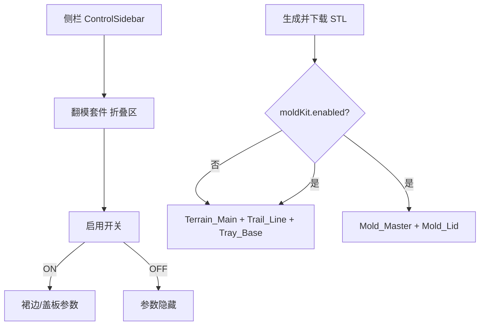
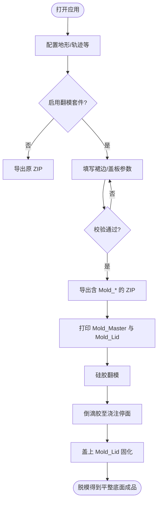

# 翻模套件（Mold Kit）— 产品需求文档

| 项目     | 说明                                                                 |
| -------- | -------------------------------------------------------------------- |
| 产品     | TrailPrint 3D                                                       |
| 文档版本 | v0.1                                                                 |
| 状态     | 待评审                                                               |
| 关联能力 | 地形主模型 `Terrain_Main.stl`、ZIP 导出、侧栏配置                    |
| 问题背景 | 硅胶翻模时底边易出毛刺；滴胶浇注后成品「地面」易不平整               |

---

## 1. 背景与目标

### 1.1 背景

用户常以 3D 打印的山体为母模做硅胶翻模，再倒入滴胶得到树脂成品。当前 `Terrain_Main` 底面与外轮廓齐平，翻模时：

1. **底边硅胶毛刺（飞边）**：母模底面与底板接缝渗胶，毛刺落在成品轮廓上，难修。
2. **浇注地面不平整**：模具敞口自由液面受表面张力、模具翘曲、固化收缩影响，成品底面不平。

### 1.2 目标（MVP）

在 **不修改** 现有 `Terrain_Main` / `Trail_Line` / `Tray_Base` 几何与装配语义的前提下，提供可选「翻模套件」：

1. 导出 **翻模主模** `Mold_Master.stl`：在山体基础厚度之下增加一圈可配置的 **裙边溢料层**，使飞边落在溢料区；滴胶只浇到原基础底面台阶即可。
2. 导出 **浇注盖板** `Mold_Lid.stl`：与裙边同形（可独立微调），盖在浇注停面上压平液面，固化后底面平整。
3. 侧栏可配置启停与尺寸；默认关闭时 ZIP 与现版完全一致。

**成功标准**：开启翻模套件后，用户可一键得到「打印母模 + 盖板」两件套，按文档流程完成硅胶翻模与滴胶，无需第三方建模软件改模。

### 1.3 非目标（本期不做）

| 不做项                         | 说明                                           |
| ------------------------------ | ---------------------------------------------- |
| 改写 `Terrain_Main` 本体       | 日常打印/托盘装配仍用原三件套                  |
| 硅胶模具 STL / 阴模自动生成    | 只提供母模与盖板；阴模由用户自行灌注硅胶       |
| 翻模件磁铁孔 / NFC / LED       | 避免型腔复杂；与托盘装配无关                   |
| 翻模件与 `Tray_Base` 装配联调  | 翻模套件不进入托盘凹槽装配逻辑                 |
| 工艺教程视频 / 耗材商城        | 文档内简要浇注说明即可                         |
| 自动检测「浇到哪一阶」的传感器 | 靠几何台阶 + UI/文档说明                       |

---

## 2. 已确认设计决策

以下在 v0.1 中拍板，实现时 **不得再悬而未决**：

| 决策项           | 结论                                                         | 说明                                                                 |
| ---------------- | ------------------------------------------------------------ | -------------------------------------------------------------------- |
| 与主模型关系     | **附加导出，不改主模型**                                     | `Terrain_Main` 几何与文件名不变                                      |
| 默认状态         | **关闭**                                                     | 未开启时 ZIP 仅含原有 STL（及既有可选扩展，如喷漆罩）                |
| 裙边位置         | **基础厚度之下**                                             | 原 `baseSolidThicknessMm` 底面成为浇注停面（内台阶）                 |
| 裙边参数         | **高度 + 外扩宽度**                                          | 高度向下挤出；宽度为相对山体外轮廓的水平外扩                         |
| 盖板参数         | **高度 + 外扩宽度**，默认与裙边相同                          | 可独立修改；另含盖板配合间隙（相对裙边外廓内缩）                     |
| 翻模主模表面     | **与 `Terrain_Main` 一致**（含轨迹挖槽）                     | 不含磁铁孔                                                           |
| 坐标系           | **与 `Terrain_Main` 同系**                                   | 中心、Z 向上；裙边在负 Z 方向延伸                                    |
| UI 入口          | **侧栏独立折叠区「翻模套件」**                               | 不塞进「地形塑造」基础厚度旁，避免与托盘边框混淆                     |
| 文件名           | `Mold_Master.stl` / `Mold_Lid.stl`                           | 固定英文名，便于切片与文档引用                                       |

---

## 3. 术语与定义

| 术语           | 定义                                                                 |
| -------------- | -------------------------------------------------------------------- |
| 基础厚度       | `terrain.baseSolidThicknessMm`：地形最低点（Z=0）到主模型纯平底面的实体厚度 |
| 浇注停面       | 原主模型底面所在平面（Z = `-baseSolidThicknessMm`）；滴胶液面应对齐此面 |
| 裙边（溢料层） | 停面之下、外轮廓外扩的一圈薄台；容纳硅胶飞边与少量溢胶               |
| 翻模主模       | `Mold_Master`：山体（含基础厚度与挖槽）+ 裙边，用作硅胶翻模母模     |
| 浇注盖板       | `Mold_Lid`：纯平实体，压在浇注停面上使树脂底面平整                   |
| 盖板间隙       | 盖板外轮廓相对裙边外轮廓的内缩量，便于放入硅胶阴模并补偿收缩         |

### 3.1 几何示意（侧视）

```text
        山体起伏（Z≥0）
      ████████████████
      ████ 基础厚度 ████     ← Terrain_Main / Mold_Master 共有部分
  ───────────────────────    ← 浇注停面 Z = -baseSolidThicknessMm
  ▓▓▓▓▓▓▓▓▓▓▓▓▓▓▓▓▓▓▓▓▓▓▓    ← 裙边：高度 moldSkirtHeightMm
  ◄─ 外扩 moldSkirtWidthMm ─►

盖板 Mold_Lid：底面纯平，外廓 = 裙边外廓内缩 moldLidClearanceMm
盖上后压在浇注停面，压平树脂液面。
```

---

## 4. 用户与使用场景

| 角色           | 场景                                                                 |
| -------------- | -------------------------------------------------------------------- |
| 滴胶手作玩家   | 打印 `Mold_Master` → 硅胶翻模 → 倒滴胶至停面 → 盖 `Mold_Lid` 固化   |
| 普通打印用户   | 不开启翻模套件，仍只导出三件套做托盘纪念碑                           |
| 进阶用户       | 调节裙边高度/外扩与盖板间隙，适配不同硅胶收缩与模具尺寸               |

### 4.0 信息架构



### 4.1 用户流程（主路径 + 异常）



### 4.2 页面 / 界面清单

| ID | 界面                 | 说明                                           |
| -- | -------------------- | ---------------------------------------------- |
| P1 | 侧栏「翻模套件」区块 | 开关 + 条件展示参数；默认折叠或放在托盘之后    |
| P2 | 3D 预览（可选增强）  | MVP 可不强制预览翻模件；P1 可叠加半透明裙边/盖板 |
| P3 | 导出进度 / ZIP       | 开启时多写两个 STL；失败提示中文               |

### 4.3 布局要点（可交付研发）

- **区块标题**：翻模套件  
- **启用开关**：关闭时隐藏子参数，且不参与导出。  
- **开启后展示**（单位均为 mm）：  
  - 裙边高度、裙边外扩宽度  
  - 盖板高度、盖板外扩宽度（默认与裙边联动；提供「与裙边同步」开关，默认开）  
  - 盖板配合间隙（高级，可默认折叠）  
- **辅助文案**（一行）：「滴胶浇至原基础底面台阶；裙边区域用于容纳飞边。」  
- **不出现在**：托盘装配预览的强制套合、磁铁孔配置联动。

---

## 5. 数据模型

### 5.1 配置实体 `MoldKitConfig`

写入 `AppConfig`（与现有五模块并列）：

```ts
/** 模块六：翻模套件（可选导出） */
export interface MoldKitConfig {
  /** 总开关；false 时不导出 Mold_*，不参与网格生成 */
  enabled: boolean;
  /** 裙边高度 (mm)：自浇注停面向下 */
  skirtHeightMm: number;
  /** 裙边外扩宽度 (mm)：相对山体打印外轮廓水平外扩 */
  skirtWidthMm: number;
  /** 盖板高度 (mm)：主要保证刚度与可打印性 */
  lidHeightMm: number;
  /** 盖板外扩宽度 (mm)：相对山体打印外轮廓；通常与 skirtWidthMm 相同 */
  lidWidthMm: number;
  /**
   * 盖板外轮廓相对裙边外轮廓的内缩间隙 (mm)。
   * 实际盖板外扩 = lidWidthMm - lidClearanceMm（且须 > 0）。
   */
  lidClearanceMm: number;
  /** 盖板尺寸是否与裙边同步（改裙边时覆盖 lidHeight/lidWidth） */
  lidSyncWithSkirt: boolean;
}
```

### 5.2 默认值（推荐）

| 字段               | 默认值 | 说明                         |
| ------------------ | ------ | ---------------------------- |
| `enabled`          | `false` | 不影响现有用户               |
| `skirtHeightMm`    | `2`    | 与常见基础厚度同量级         |
| `skirtWidthMm`     | `2`    | 足够容纳飞边                 |
| `lidHeightMm`      | `2`    | 与裙边同步                   |
| `lidWidthMm`       | `2`    | 与裙边同步                   |
| `lidClearanceMm`   | `0.2`  | 补偿硅胶收缩与打印公差       |
| `lidSyncWithSkirt` | `true` | 改裙边时自动改盖板高/宽      |

### 5.3 校验规则

| 规则 ID | 条件                                                                 | 失败提示（中文）                                       |
| ------- | -------------------------------------------------------------------- | ------------------------------------------------------ |
| V1      | `skirtHeightMm > 0`                                                  | 裙边高度必须大于 0                                     |
| V2      | `skirtWidthMm > 0`                                                   | 裙边外扩宽度必须大于 0                                 |
| V3      | `lidHeightMm ≥ 1.0`（建议下限，可配置常量）                          | 盖板过薄易翘曲，高度建议至少 1 mm                      |
| V4      | `lidWidthMm > lidClearanceMm`                                        | 盖板外扩须大于配合间隙，否则盖板外廓无效               |
| V5      | `lidClearanceMm ≥ 0`                                                 | 盖板配合间隙不能为负                                   |
| V6      | 开启时须已具备可导出的地形主模前提（与现有导出 Gate 一致，如已导入 GPX、裁剪有效） | 沿用现有导出错误文案                                   |

`enabled === false` 时 **跳过** V1–V5（或仅在开启时校验）。

### 5.4 导出清单扩展

| 文件名             | 条件                 | 说明                                                                 |
| ------------------ | -------------------- | -------------------------------------------------------------------- |
| `Terrain_Main.stl` | 始终                 | **不变**                                                             |
| `Trail_Line.stl`   | 始终                 | **不变**                                                             |
| `Tray_Base.stl`    | 始终                 | **不变**                                                             |
| `Mold_Master.stl`  | `moldKit.enabled`    | 山体（含基础厚度、轨迹挖槽，**无磁铁孔**）+ 底部裙边                 |
| `Mold_Lid.stl`     | `moldKit.enabled`    | 纯平盖板；外廓 = 山体外轮廓外扩 `lidWidthMm` 后再内缩 `lidClearanceMm` |

可选（P2）：`mold_kit_readme.txt` 简要浇注步骤；MVP 可不做，以应用内文案 + 本 PRD 为准。

---

## 6. 核心功能需求

### 6.1 配置与 UI（F-01）

| ID     | 需求                                                                 | 优先级 |
| ------ | -------------------------------------------------------------------- | ------ |
| F-01-1 | 侧栏「翻模套件」折叠区 + 启用开关                                    | P0     |
| F-01-2 | 开启后可编辑裙边高度、裙边外扩宽度                                   | P0     |
| F-01-3 | 开启后可编辑盖板高度、盖板外扩宽度；默认与裙边同步                   | P0     |
| F-01-4 | 「与裙边同步」关闭后，盖板高/宽可独立配置                            | P0     |
| F-01-5 | 盖板配合间隙可配置（可放在高级折叠内）                               | P0     |
| F-01-6 | 非法参数表单校验，中文提示，阻止导出                                 | P0     |
| F-01-7 | 关闭开关后导出行为与未实现本功能前一致                               | P0     |
| F-01-8 | 3D 预览中显示翻模主模裙边 / 盖板位置（半透明）                       | P1     |
| F-01-9 | 预览标注「浇注停面」辅助线                                           | P2     |

### 6.2 几何生成（F-02）

| ID     | 需求                                                                 | 优先级 |
| ------ | -------------------------------------------------------------------- | ------ |
| F-02-1 | 生成封闭可打印网格 `Mold_Master`                                     | P0     |
| F-02-2 | 主模上部与同时刻 `Terrain_Main` 的地形+挖槽一致（不含磁铁孔）        | P0     |
| F-02-3 | 裙边：自浇注停面向下挤出 `skirtHeightMm`，外轮廓为山体外轮廓外扩 `skirtWidthMm` | P0     |
| F-02-4 | 裙边顶面与浇注停面共面，形成清晰内台阶                               | P0     |
| F-02-5 | 生成封闭可打印网格 `Mold_Lid`，顶底面纯平                            | P0     |
| F-02-6 | 盖板外轮廓 = 山体外轮廓外扩 `lidWidthMm` 后内缩 `lidClearanceMm`     | P0     |
| F-02-7 | 盖板在导出坐标系中可与主模裙边对齐预览（Z 向可置于停面之上或单独摆放，切片前由用户摆姿） | P0     |
| F-02-8 | 外轮廓形状跟随模块一（圆/矩形/多边形及 R 角）                        | P0     |

### 6.3 导出（F-03）

| ID     | 需求                                           | 优先级 |
| ------ | ---------------------------------------------- | ------ |
| F-03-1 | `enabled` 时 ZIP 增加 `Mold_Master.stl`、`Mold_Lid.stl` | P0 |
| F-03-2 | `enabled === false` 时不出现上述文件           | P0     |
| F-03-3 | 导出进度文案区分「生成翻模主模 / 盖板」        | P1     |
| F-03-4 | 与喷漆遮罩等其它可选导出可同时存在，互不覆盖   | P0     |

---

## 7. 状态机

### 7.1 状态枚举（翻模套件配置态）

| 状态        | 说明                               |
| ----------- | ---------------------------------- |
| `Disabled`  | 未启用；不校验裙边/盖板、不导出    |
| `Editing`   | 已启用；参数可编辑                 |
| `Invalid`   | 已启用但校验失败；禁止导出         |
| `Ready`     | 已启用且校验通过；允许进入导出     |

### 7.2 转移规则

| 当前状态   | 动作           | 目标状态   | 前置条件     | 失败分支 / 提示                |
| ---------- | -------------- | ---------- | ------------ | ------------------------------ |
| `Disabled` | 打开启用开关   | `Editing`→校验 | —         | 校验失败则进入 `Invalid`       |
| `Editing`  | 修改参数       | 重新校验   | enabled      | 失败 → `Invalid`；成功 → `Ready` |
| `Invalid`  | 修改参数至合法 | `Ready`    | enabled      | —                              |
| `Ready`/`Invalid`/`Editing` | 关闭开关 | `Disabled` | —     | 清除导出侧翻模件生成任务       |
| `Ready`    | 点击导出       | （导出流程） | 全局导出 Gate 通过 | 沿用现有导出失败提示        |
| `Invalid`  | 点击导出       | 停留 `Invalid` | —       | 「请修正翻模套件参数后再导出」 |

> 本功能无服务端审批/多用户权限；「权限」不适用，以本地校验代替。

---

## 8. 异常与边界

| 类别     | 要求                                                                 |
| -------- | -------------------------------------------------------------------- |
| 空态     | 未导入 GPX 时：开关可展示，但导出仍被全局 Gate 拦截                  |
| 极小外扩 | `skirtWidthMm` 过小导致外扩轮廓自交/退化时，校验或生成失败并中文说明 |
| 极大尺寸 | 外扩后轮廓超出合理打印床：不强制拦截（MVP）；可 P2 警告              |
| 同步逻辑 | `lidSyncWithSkirt === true` 时改裙边高/宽立即覆盖盖板高/宽；改间隙不触发覆盖 |
| 并发导出 | 沿用现有导出互斥/进度，避免重复点击打乱 ZIP                          |
| 与磁铁   | `Mold_Master` **永不**打磁铁孔，即使装配开关开启                     |
| 与喷漆   | 可同时导出；文件名不冲突                                             |

---

## 9. 非功能需求

| 类别     | 要求                                                         |
| -------- | ------------------------------------------------------------ |
| 性能     | 裙边/盖板为外轮廓挤出，须在主进程异步生成；不得卡住渲染进程  |
| 可重复性 | 相同 `AppConfig` + 相同地形中间结果 → `Mold_*` 几何一致      |
| 兼容     | 关闭功能时，行为与未合入本需求前的版本一致                   |
| 网格质量 | 导出 STL 封闭、无错误开放边（与现有托盘/主模同等标准）       |

---

## 10. 验收标准（DoD）

### 10.1 功能 DoD

- [ ] 默认关闭；关闭时 ZIP 不含 `Mold_*.stl`
- [ ] 开启且参数合法时，ZIP 含 `Mold_Master.stl`、`Mold_Lid.stl`，且原三件套仍存在且语义不变
- [ ] `Mold_Master` 存在清晰浇注停面台阶；裙边高度/外扩与配置误差在打印精度可接受范围内（建议 ≤ 0.05 mm 量级几何误差）
- [ ] `Mold_Master` 无磁铁孔；表面挖槽与同次导出的 `Terrain_Main` 一致（磁铁除外）
- [ ] `Mold_Lid` 顶底纯平；外廓满足「外扩 − 间隙」
- [ ] 非法参数无法导出，并显示中文原因
- [ ] 「与裙边同步」行为符合 §5.2 / §8

### 10.2 质量 DoD

- [ ] 生成失败不导致应用崩溃
- [ ] 典型尺寸下开启翻模套件不明显拖慢导出（相对仅三件套增加可接受）
- [ ] 侧栏文案为简体中文

---

## 11. 验收用例清单

### 11.1 开关与导出

| 编号    | 步骤                         | 期望                                     |
| ------- | ---------------------------- | ---------------------------------------- |
| TC-M-01 | 默认配置直接导出             | ZIP 无 `Mold_Master` / `Mold_Lid`        |
| TC-M-02 | 开启翻模，合法参数导出       | ZIP 含两文件 + 原三件套                  |
| TC-M-03 | 开启后关闭再导出             | ZIP 再次不含 Mold_*                      |
| TC-M-04 | 与喷漆分色同时开启导出       | Mask_* 与 Mold_* 可同时存在              |

### 11.2 参数与校验

| 编号    | 步骤                                      | 期望                         |
| ------- | ----------------------------------------- | ---------------------------- |
| TC-M-05 | `skirtHeightMm = 0` 导出                  | 拦截 + 中文提示              |
| TC-M-06 | `lidWidthMm ≤ lidClearanceMm` 导出        | 拦截 + 中文提示              |
| TC-M-07 | 同步开启时改 `skirtWidthMm`               | `lidWidthMm` 跟随变化        |
| TC-M-08 | 关闭同步后只改盖板高度                    | 裙边高度不变                 |

### 11.3 几何

| 编号    | 步骤                                      | 期望                                                         |
| ------- | ----------------------------------------- | ------------------------------------------------------------ |
| TC-M-09 | 圆形底座，裙边高 2 / 外扩 2               | 主模底面总高 = 基础厚度 + 2；外径相对山体 +4 mm（直径）     |
| TC-M-10 | 矩形 + R 角                               | 裙边/盖板外轮廓继承圆角逻辑                                  |
| TC-M-11 | 装配磁铁开启 + 翻模开启                   | `Terrain_Main` 可有孔；`Mold_Master` 无孔                    |
| TC-M-12 | 对比同次 `Terrain_Main` 与 `Mold_Master` 上部 | 挖槽与地形一致（目视/网格哈希或抽样顶点）                 |

### 11.4 边界

| 编号    | 步骤                         | 期望                     |
| ------- | ---------------------------- | ------------------------ |
| TC-M-13 | 未导入 GPX 开启翻模点导出    | 全局 Gate 失败提示       |
| TC-M-14 | 导出过程中重复点击           | 不产生损坏 ZIP / 不崩溃  |

---

## 12. 决策点（已建议默认，评审可改）

| ID  | 问题                                           | 推荐默认                         | 影响                         |
| --- | ---------------------------------------------- | -------------------------------- | ---------------------------- |
| D1  | 盖板间隙是否 UI 暴露                           | 暴露在「高级」折叠，默认 0.2 mm  | 新手省事，高手可调           |
| D2  | MVP 是否必须 3D 预览翻模件                     | 不做强制；P1 再做                | 降低首期工期                 |
| D3  | 盖板在 ZIP 中的摆放 Z                          | 底面置于 Z=0 的独立件即可        | 切片时用户自己摆             |
| D4  | 是否附带 `mold_kit_readme.txt`                 | MVP 不做                         | 减少交付物噪音               |
| D5  | `lidHeightMm` 硬性下限                         | ≥ 1.0 mm                         | 减少翘曲客诉                 |
| D6  | 翻模主模是否包含轨迹挖槽                       | **包含**（与 Terrain_Main 一致） | 树脂件可嵌轨迹线或留槽       |

---

## 13. 建议任务拆分（供任务索引引用）

| 建议任务 | 内容                         | 依赖兼具           |
| -------- | ---------------------------- | ------------------ |
| 任务-A   | 配置类型 + 侧栏 UI + 校验    | 任务-08、config 层 |
| 任务-B   | `Mold_Master` / `Mold_Lid` 网格生成 | 任务-03、足迹外轮廓 |
| 任务-C   | ZIP 导出接入 + 验收用例      | 任务-07、任务-A/B  |

正式编号待评审后写入 `任务索引.md`。

---

## 14. 需求匹配度自检

| 检查项     | 结论 |
| ---------- | ---- |
| 用户所述：基础厚度下增加可配高度/外扩的一层 | ✅ §1.2、§5、F-02-3 |
| 滴胶只浇到基础厚度停面，毛刺可落在裙边     | ✅ §3、F-01 文案、F-02-4 |
| 配套盖板，可配高度/外扩，默认与增层一致   | ✅ §2、§5.2、F-01-3 |
| 多出两个模型，不影响原模型                 | ✅ §1.3、§2、F-03 |
| 盖板间隙（评审建议）                       | ✅ 已纳入 D1/默认 0.2 mm |
| 状态机 / 验收 / 决策点                     | ✅ §7、§10–12 |
| 权限/多租户                                | N/A（本地 Electron 工具） |

**覆盖度**：对话中明确需求点 6/6 已覆盖；实现前待评审确认决策点 D1–D6。
